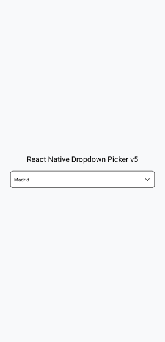
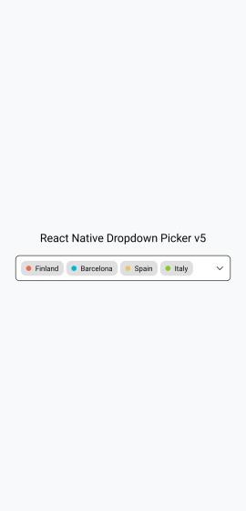
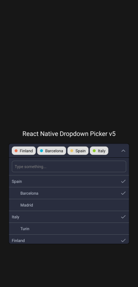

# React Native Dropdown Picker

[](https://github.com/hossein-zare/react-native-dropdown-picker)
[](https://actions-badge.atrox.dev/hossein-zare/react-native-dropdown-picker/goto?ref=dev-5.x)
[](https://github.com/hossein-zare/react-native-dropdown-picker/blob/dev-5.x/CONTRIBUTING.md)
[](https://github.com/hossein-zare/react-native-dropdown-picker/blob/dev-5.x/LICENSE)
[](https://www.npmjs.org/package/react-native-dropdown-picker)
[](https://www.npmjs.org/package/react-native-dropdown-picker)
[](https://hossein-zare.github.io/react-native-dropdown-picker-website/docs)

---

## 📱 Screenshots

[](https://raw.githubusercontent.com/hossein-zare/react-native-dropdown-picker/dev-5.x/.github/assets/images/screenshots/basic_full.png)
[](https://raw.githubusercontent.com/hossein-zare/react-native-dropdown-picker/dev-5.x/.github/assets/images/screenshots/badges_full.png)
[](https://raw.githubusercontent.com/hossein-zare/react-native-dropdown-picker/dev-5.x/.github/assets/images/screenshots/dark_theme_parent_items_full.png)

The above screenshots were taken
from [this example](https://snack.expo.dev/8mHmLfcZf).

## 👋 Usage

### Basic usage

The following code shows basic usage of this library:

```javascript
import React, {useState} from 'react';
import {View, Text} from 'react-native';
import DropDownPicker from 'react-native-dropdown-picker';

export default function App() {
    const [open, setOpen] = useState(false);
    const [value, setValue] = useState(null);
    const [items, setItems] = useState([
        {label: 'Apple', value: 'apple'},
        {label: 'Banana', value: 'banana'},
        {label: 'Pear', value: 'pear'},
    ]);

    return (
        <View style={{flex: 1}}>
            <View
                style={{
                    flex: 1,
                    alignItems: 'center',
                    justifyContent: 'center',
                    paddingHorizontal: 15,
                }}>
                <DropDownPicker
                    open={open}
                    value={value}
                    items={items}
                    setOpen={setOpen}
                    setValue={setValue}
                    setItems={setItems}
                    placeholder={'Choose a fruit.'}
                />
            </View>

            <View style={{
                flex: 1,
                alignItems: 'center',
                justifyContent: 'center'
            }}>
                <Text>Chosen fruit: {value === null ? 'none' : value}</Text>
            </View>
        </View>
    );
}
```

### Further information on usage

You can find more examples in the `examples` subdirectory. This subdirectory is
a working [Expo](https://github.com/expo/expo) project demonstrating this
library. It shows how to use this library with class components as well as with
function components, and in TypeScript as well as in JavaScript. Navigate into
the `examples` subdirectory, run `npm install`, and then run `npx expo start` to
see the examples working.

For further information on how to use this library,
read [the usage documentation](https://hossein-zare.github.io/react-native-dropdown-picker-website/docs/usage).

## 📄 Further documentation

The docs can be read
at: [https://hossein-zare.github.io/react-native-dropdown-picker-website](https://hossein-zare.github.io/react-native-dropdown-picker-website)

The docs can be edited
at: [https://github.com/hossein-zare/react-native-dropdown-picker-website](https://github.com/hossein-zare/react-native-dropdown-picker-website)

## 😕 Support and issues

If you have questions or need help, you
can [ask a question on Stack Overflow](https://stackoverflow.com/questions/tagged/react-native-dropdown-picker)
or [make a GitHub issue](https://github.com/hossein-zare/react-native-dropdown-picker/issues/new/choose).
You can also make a GitHub issue to report a bug or make a feature request.

## 🚀️ Contributing

See [CONTRIBUTING.md](https://github.com/hossein-zare/react-native-dropdown-picker/blob/dev-5.x/CONTRIBUTING.md).
